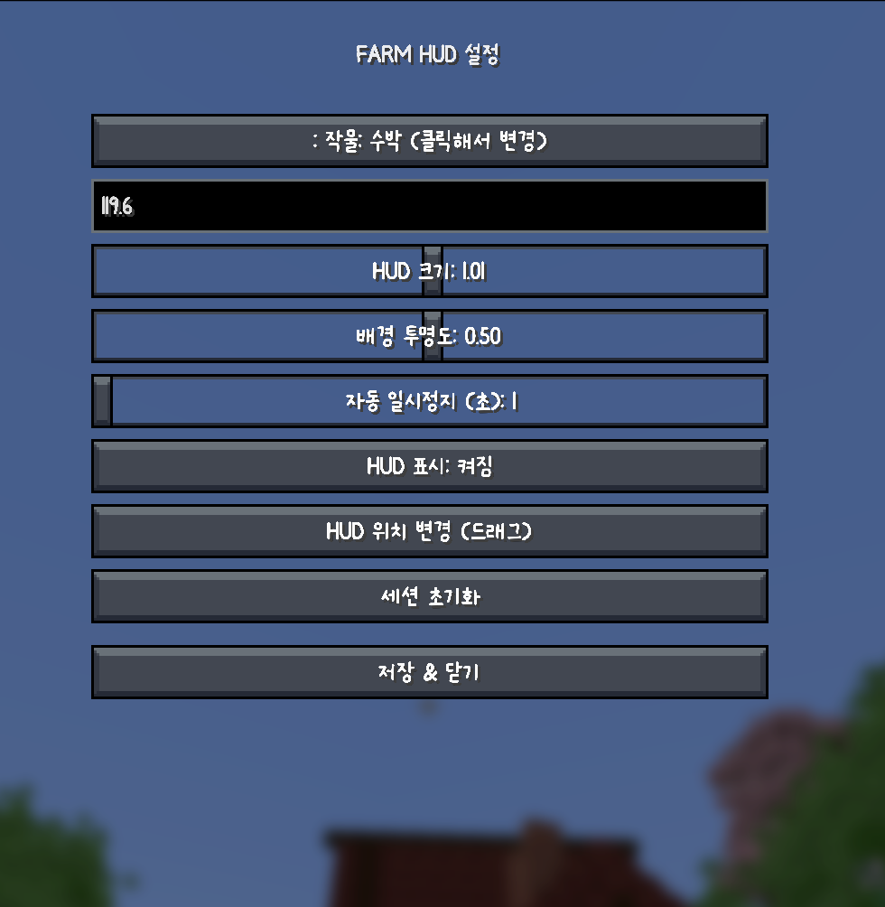

# FARM HUD

FARM HUD는 Minecraft Fabric 1.21.4용 클라이언트 HUD 모드입니다.

농사 중 수확량, 수익, 경과 시간을 HUD로 간단하게 확인할 수 있으며, 드래그 가능한 HUD와 직관적인 설정 화면을 제공합니다.

## 주요 기능

- 작물 수확량 실시간 표시
- 세션 기준 총 수익 표시
- 경과 시간 표시
- 드래그로 HUD 위치 이동 가능
- HUD 크기 조절
- HUD 배경 투명도 조절
- 간단하고 직관적인 설정 화면
- 클라이언트 전용 모드

## 지원 버전

- Minecraft `1.21.4`
- Fabric Loader
- Fabric API

## 스크린샷

### 설정 화면

## 설치 방법

1. [Fabric Loader](https://fabricmc.net/use/installer/)를 설치합니다.
2. Fabric API를 설치합니다.
3. 모드 `.jar` 파일을 `mods` 폴더에 넣습니다.
4. Fabric 프로필로 Minecraft를 실행합니다.

## 사용 방법

1. 게임 내에서 설정 화면을 엽니다.
2. 추적할 작물을 선택합니다.
3. 필요하면 작물 가격을 설정합니다.
4. `HUD 위치 변경 (드래그)` 화면에서 HUD 위치를 옮깁니다.
5. 농사를 시작하면 HUD에서 현재 세션 정보를 확인할 수 있습니다.

## 참고 사항

- 이 모드는 클라이언트 전용입니다.
- 수익은 설정 화면에 입력한 작물 가격을 기준으로 계산됩니다.
- HUD는 현재 농사 세션을 빠르게 확인할 수 있도록 제작되었습니다.
